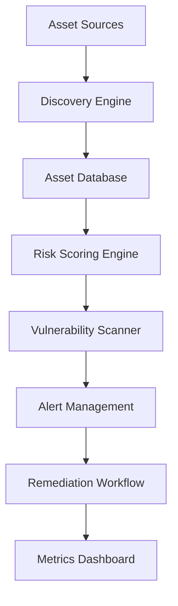

# **How to 10X Your Security: A Comprehensive Implementation Guide**

---

## **Table of Contents**

**Part I: Security Program Fundamentals**
- Chapter 1: Building Your Security Foundation
- Chapter 2: Vulnerability Management at Scale
- Chapter 3: Asset Inventory and Continuous Scanning
- Chapter 4: Security Metrics That Matter

**Part II: Scaling Security Efforts**
- Chapter 5: The Paved Road Philosophy
- Chapter 6: Democratizing Threat Modeling
- Chapter 7: Detection and Response Engineering
- Chapter 8: Security Automation Strategies

**Part III: Advanced Security Strategies**
- Chapter 9: Eliminating Vulnerability Classes
- Chapter 10: Security Invariants and Guardrails
- Chapter 11: Zero Trust Implementation
- Chapter 12: Building Security Culture

**Part IV: Implementation Guides**
- Chapter 13: Tool Selection and Integration
- Chapter 14: Company Case Studies
- Chapter 15: Action Plans and Roadmaps

**Appendices**
- A: Security Tool Comparison Matrix
- B: Resource Collections
- C: Templates and Checklists
- D: Career Development Guide

---

# **Part I: Security Program Fundamentals**

## **Chapter 1: Building Your Security Foundation**

### **The 10X Security Mindset**

The journey to 10X security begins with a fundamental shift in thinking. As Clint Gibler emphasizes, scaling security isn't about hiring 10 times more people—it's about building systems and processes that multiply the impact of your existing team.

**Core Principles:**
1. **Secure defaults over vulnerability hunting** - Prevention beats detection
2. **Guardrails over gatekeepers** - Automated controls beat manual reviews
3. **Developer enablement over security theater** - Make security easy to adopt
4. **Continuous improvement over perfection** - Iterate based on data

### **The Artisanal to Industrial Transformation**

Phil Venables' framework for security transformation provides the theoretical foundation:

**Artisanal Security:**
- Individual expertise dependent
- Manual processes
- Reactive responses
- High variability in outcomes

**Industrial Security:**
- Systematic approaches
- Automated controls
- Proactive prevention
- Consistent, measurable results

### **Starting Your Security Program**

**Phase 1: Assessment (Weeks 1-4)**
```
1. Asset Discovery
   - Use Lyft/cartography to map infrastructure
   - Document all applications and services
   - Identify data flows and dependencies
   
2. Risk Assessment
   - Catalog existing vulnerabilities
   - Identify critical assets
   - Map threat landscape
   
3. Team Structure
   - Define roles and responsibilities
   - Identify skill gaps
   - Plan for scaling
```

**Phase 2: Foundation Building (Months 2-3)**
```
1. Implement Core Tools
   - SAST: Semgrep with custom rules
   - Container Scanning: Trivy
   - Dependency Scanning: OSV Scanner
   
2. Establish Baselines
   - Security invariants definition
   - Vulnerability management SLAs
   - Incident response procedures
```

---

## **Chapter 2: Vulnerability Management at Scale**

### **The Vulnerability Class Elimination Strategy**

Instead of playing whack-a-mole with individual vulnerabilities, focus on eliminating entire classes:

**Priority Vulnerability Classes:**
1. **SQL Injection** - Implement parameterized queries everywhere
2. **XSS** - Deploy secure templating engines with auto-escaping
3. **Authentication Bypass** - Standardize on secure auth libraries
4. **Insecure Direct Object References** - Implement proper authorization frameworks

### **Risk-Based Prioritization Framework**

Combine multiple factors for intelligent prioritization:

```python
def calculate_priority_score(vulnerability):
    # Base CVSS Score (0-10)
    cvss = vulnerability.cvss_score
    
    # Exploit Prediction Score (0-1)
    epss = vulnerability.epss_score
    
    # Business Context Multiplier
    asset_criticality = get_asset_criticality(vulnerability.asset)
    exposure = get_network_exposure(vulnerability.asset)
    
    # Priority Score Formula
    priority = (cvss * 0.3) + (epss * 100 * 0.4) + 
               (asset_criticality * 0.2) + (exposure * 0.1)
    
    return priority
```

### **Continuous Scanning Implementation**

**CI/CD Integration Pattern:**
```yaml
name: Security Scanning Pipeline
on: [push, pull_request]

jobs:
  security-scan:
    runs-on: ubuntu-latest
    steps:
    - uses: actions/checkout@v3
    
    # SAST Scanning
    - name: Run Semgrep
      uses: semgrep/semgrep-action@v1
      with:
        config: >-
          p/security-audit
          p/owasp-top-ten
          .semgrep/custom-rules.yml
    
    # Container Scanning
    - name: Run Trivy
      uses: aquasecurity/trivy-action@master
      with:
        scan-type: 'fs'
        scan-ref: '.'
        format: 'sarif'
        severity: 'CRITICAL,HIGH'
    
    # Dependency Scanning
    - name: Run OSV Scanner
      run: |
        osv-scanner --lockfile=package-lock.json
        osv-scanner --lockfile=requirements.txt
```

### **Metrics and KPIs**

Track these vulnerability management metrics:

1. **Mean Time to Detection (MTTD)** - How quickly vulnerabilities are discovered
2. **Mean Time to Remediation (MTTR)** - How quickly they're fixed
3. **Vulnerability Escape Rate** - % that make it to production
4. **Class Reduction Rate** - Decrease in specific vulnerability types over time

---

## **Chapter 3: Asset Inventory and Continuous Scanning**

### **Building Comprehensive Asset Inventory**

Netflix's approach demonstrates the importance of automated asset discovery:

**Implementation with Cartography:**
```python
# cartography_config.py
import cartography.cli

def run_asset_discovery():
    # Configure Neo4j connection
    neo4j_uri = "bolt://localhost:7687"
    
    # Run discovery for multiple providers
    providers = ['aws', 'gcp', 'github', 'kubernetes']
    
    for provider in providers:
        cartography.cli.main([
            '--neo4j-uri', neo4j_uri,
            f'--{provider}-sync-all-profiles'
        ])
```

**Asset Classification Framework:**
```
Critical Assets (Tier 1):
├── Customer Data Stores
├── Payment Processing Systems
├── Authentication Services
└── Core Business Logic

Important Assets (Tier 2):
├── Internal Tools
├── Development Systems
├── Analytics Platforms
└── Support Systems

Standard Assets (Tier 3):
├── Marketing Sites
├── Documentation
├── Test Environments
└── Non-sensitive Services
```

### **Continuous Monitoring Architecture**



---

## **Chapter 4: Security Metrics That Matter**

### **Ryan McGeehan's KPI Framework**

Focus on metrics that drive action and demonstrate value:

**Leading Indicators:**
1. **Secure by Default Adoption** - % of services using secure frameworks
2. **Paved Road Usage** - % of deployments using standard patterns
3. **Security Training Completion** - % of developers trained on secure coding
4. **Automated Security Coverage** - % of code covered by security scanning

**Lagging Indicators:**
1. **Security Incidents** - Count and severity over time
2. **Vulnerability Trends** - Classes of vulnerabilities discovered
3. **Time to Patch** - Average remediation time by severity
4. **Security Debt** - Backlog of security issues

### **Building Security Dashboards**

```python
# security_metrics.py
class SecurityMetrics:
    def __init__(self):
        self.metrics = {
            'vulnerability_count': self.get_vuln_count(),
            'mttr_by_severity': self.calculate_mttr(),
            'secure_defaults_adoption': self.measure_adoption(),
            'security_coverage': self.calculate_coverage()
        }
    
    def generate_executive_dashboard(self):
        return {
            'risk_score': self.calculate_risk_score(),
            'trend': self.get_trend_direction(),
            'top_risks': self.get_top_risks(5),
            'investment_roi': self.calculate_security_roi()
        }
```

---

# **Part II: Scaling Security Efforts**

## **Chapter 5: The Paved Road Philosophy**

### **Netflix's Paved Road Implementation**

The Paved Road concept, pioneered by Netflix, represents a paradigm shift in security scaling:

**Core Components:**
1. **Authentication Library** - Standardized, hardened, well-documented
2. **Authorization Framework** - mTLS between services by default
3. **Secret Management** - Automated secret bootstrapping
4. **Deployment Pipeline** - Security built into CI/CD

### **Building Your Own Paved Roads**

**Step 1: Identify Common Patterns**
```python
# Analyze your codebase for patterns
common_patterns = {
    'authentication': count_auth_implementations(),
    'database_access': count_db_patterns(),
    'api_calls': count_api_patterns(),
    'file_operations': count_file_patterns()
}

# Focus on top 3-5 patterns for initial paved roads
```

**Step 2: Create Secure Defaults**
```python
# Example: Secure Database Access Paved Road
class SecureDatabase:
    def __init__(self, connection_string):
        self.conn = self._create_secure_connection(connection_string)
        self.query_logger = SecurityAuditLogger()
        
    def execute_query(self, query, params):
        # Automatic parameterization
        sanitized_query = self._parameterize(query)
        
        # Automatic logging
        self.query_logger.log(query, params, user_context())
        
        # Automatic timeout
        with timeout(30):
            return self.conn.execute(sanitized_query, params)
```

**Step 3: Make It the Easiest Path**
- Comprehensive documentation
- IDE integration and code snippets
- Automated migration tools
- Performance optimization

### **Measuring Paved Road Success**

Netflix's metrics showed:
- **20% of critical vulnerabilities** preventable with paved road authentication
- **12% preventable** with standardized vulnerability scanning
- **68% adoption rate** within 6 months of launch

---

## **Chapter 6: Democratizing Threat Modeling**

### **Segment's "Security Team Goes on Vacation" Model**

Jeevan Singh's revolutionary approach makes threat modeling accessible to all:

**Traditional vs. Democratized Threat Modeling:**

| Traditional | Democratized |
|------------|--------------|
| Security-led sessions | Engineer-led sessions |
| Bottleneck on security team | Scales with engineering |
| Expert-dependent | Process-dependent |
| Inconsistent coverage | Systematic coverage |

### **5-Phase Implementation Plan**

**Phase 1: Foundation (Weeks 1-2)**
- Document current threat modeling practices
- Identify pilot teams
- Prepare training materials

**Phase 2: Training Program (Weeks 3-6)**
```
Module 1: Threat Modeling Basics (2 hours)
├── What is threat modeling?
├── Why it matters for your team
├── Basic threat categories
└── Introduction to methodology

Module 2: Asset-Based Approach (3 hours)
├── Identifying critical assets
├── Mapping data flows
├── Understanding trust boundaries
└── Hands-on exercise

Module 3: Practical Application (3 hours)
├── Real system walkthrough
├── Group threat modeling session
├── Documentation standards
└── Integration with design docs
```

**Phase 3: Guided Self-Service (Weeks 7-12)**
- Security team observes sessions
- Provides real-time coaching
- Documents common patterns

**Phase 4: Full Self-Service (Month 4+)**
- Teams run independent sessions
- Security provides async review
- Continuous improvement cycle

### **Threat Modeling Templates**

**Design Document Integration:**
```markdown
## Security Considerations

### Assets
- User authentication tokens (Critical)
- Payment information (Critical)
- User preferences (Medium)
- Application logs (Low)

### Threat Analysis
| Asset | Threat | Mitigation | Status |
|-------|--------|------------|--------|
| Auth tokens | Token theft | Short expiry, rotation | Implemented |
| Payment info | Data breach | Encryption at rest | Planned |

### Security Requirements
- [ ] All API endpoints require authentication
- [ ] PII must be encrypted in transit and at rest
- [ ] Audit logs for all data access
```

---

## **Chapter 7: Detection and Response Engineering**

### **Building Detection Infrastructure**

Inspired by Asana's engineering-first approach:

**Detection Pipeline Architecture:**
```python
class DetectionPipeline:
    def __init__(self):
        self.data_sources = [
            CloudTrailCollector(),
            ApplicationLogCollector(),
            NetworkFlowCollector(),
            EndpointCollector()
        ]
        
    def process_events(self):
        for source in self.data_sources:
            events = source.collect()
            enriched = self.enrich_events(events)
            detections = self.run_detections(enriched)
            self.handle_detections(detections)
```

### **Detection as Code**

**Example Detection Rules:**
```yaml
# suspicious_authentication.yml
name: Suspicious Authentication Pattern
description: Detects unusual authentication behavior
logic:
  - event_type: authentication
  - WHERE:
      - failed_attempts > 5 
      - OR geographic_anomaly = true
      - OR impossible_travel = true
severity: high
response:
  - notify: security-team
  - action: block_ip_temporarily
  - collect: additional_context
```

### **Automated Response Patterns**

Following Chris Farris's Three Laws of Auto-Remediation:

```python
class AutoRemediator:
    def remediate(self, detection):
        # Law 1: Never harm stateful data
        if self.would_impact_stateful_data(detection):
            return self.alert_human(detection)
        
        # Law 2: Act with utmost haste
        remediation = self.immediate_response(detection)
        
        # Law 3: Announce existence
        self.notify_stakeholders(
            action=remediation,
            reason=detection.description,
            rollback_instructions=self.get_rollback()
        )
```

---

## **Chapter 8: Security Automation Strategies**

### **Automation Framework**

**Prioritization Matrix:**
```
High Volume + Low Complexity = Automate First
├── Vulnerability scanning
├── Certificate management
├── Access reviews
└── Compliance checks

High Volume + High Complexity = Gradual Automation
├── Incident response
├── Threat modeling
├── Code review
└── Risk assessments

Low Volume + Low Complexity = Quick Wins
├── Onboarding tasks
├── Report generation
├── Metric collection
└── Alert triage

Low Volume + High Complexity = Human-Centric
├── Security architecture
├── Vendor assessments
├── Policy decisions
└── Strategic planning
```

### **Security Automation Toolkit**

**Essential Automation Components:**
```python
# security_automation/toolkit.py
class SecurityAutomationToolkit:
    
    def __init__(self):
        self.scanners = {
            'sast': SemgrepScanner(),
            'containers': TrivyScanner(),
            'dependencies': OSVScanner(),
            'infrastructure': CartographyScanner()
        }
        
        self.remediators = {
            'patches': AutoPatcher(),
            'configs': ConfigRemediator(),
            'access': AccessRemediator(),
            'incidents': IncidentResponder()
        }
        
        self.reporters = {
            'metrics': MetricsReporter(),
            'compliance': ComplianceReporter(),
            'executives': ExecutiveReporter()
        }
```

---

# **Part III: Advanced Security Strategies**

## **Chapter 9: Eliminating Vulnerability Classes**

### **The Class Elimination Methodology**

Based on r2c's approach to reducing XSS by 50%:

**Step 1: Identify Vulnerability Classes**
```sql
-- Analyze historical vulnerabilities
SELECT 
    vulnerability_type,
    COUNT(*) as occurrences,
    AVG(time_to_fix) as avg_fix_time,
    SUM(impact_score) as total_impact
FROM vulnerabilities
WHERE discovered_date > NOW() - INTERVAL '1 year'
GROUP BY vulnerability_type
ORDER BY total_impact DESC;
```

**Step 2: Design Prevention Mechanisms**

**XSS Prevention Example:**
```javascript
// Secure React Component Template
import DOMPurify from 'dompurify';

const SecureComponent = ({ userContent }) => {
    // Automatic sanitization
    const sanitized = DOMPurify.sanitize(userContent, {
        ALLOWED_TAGS: ['b', 'i', 'em', 'strong'],
        ALLOWED_ATTR: []
    });
    
    return (
        <div 
            dangerouslySetInnerHTML={{ __html: sanitized }}
            // CSP headers prevent inline script execution
        />
    );
};
```

**SQL Injection Prevention:**
```python
# Secure Database Abstraction
class SecureDB:
    def query(self, template, params):
        # Force parameterization
        if not self._is_parameterized(template):
            raise SecurityError("Query must use parameters")
        
        # Validate param types
        validated_params = self._validate_types(params)
        
        # Execute with timeout and logging
        return self._execute_safe(template, validated_params)
```

### **Implementation Roadmap**

**Quarter 1: Foundation**
- Inventory vulnerability classes
- Prioritize by impact
- Design prevention strategies

**Quarter 2: Implementation**
- Build secure libraries
- Create migration tools
- Update documentation

**Quarter 3: Migration**
- Pilot with early adopters
- Refine based on feedback
- Scale across organization

**Quarter 4: Enforcement**
- Enable blocking in CI/CD
- Track adoption metrics
- Celebrate wins

---

## **Chapter 10: Security Invariants and Guardrails**

### **Chris Farris's Security Invariants Framework**

**The 4-Step Process:**

**1. Identify Scope**
```yaml
# security_invariants.yml
invariants:
  - name: No Public S3 Buckets
    scope: all_s3_buckets
    exception_process: security_review
    
  - name: All Databases Encrypted
    scope: all_rds_instances
    exception_process: none
    
  - name: MFA Required for Production
    scope: production_access
    exception_process: time_limited
```

**2. Measure Adherence**
```python
def measure_invariant_compliance():
    results = {}
    for invariant in security_invariants:
        total = count_resources(invariant.scope)
        compliant = count_compliant(invariant)
        results[invariant.name] = {
            'compliance_rate': compliant / total,
            'violations': total - compliant,
            'trend': calculate_trend(invariant)
        }
    return results
```

**3. Document Exceptions**
```json
{
  "exception_id": "EXC-2024-001",
  "invariant": "No Public S3 Buckets",
  "resource": "static-marketing-assets",
  "justification": "Public website assets",
  "approved_by": "security-team",
  "expiry": "2024-12-31",
  "compensating_controls": [
    "No sensitive data allowed",
    "Automated content scanning",
    "CloudFront distribution only"
  ]
}
```

**4. Prevent Regressions**
```python
# Enforcement via Service Control Policies
scp_policy = {
    "Version": "2012-10-17",
    "Statement": [{
        "Effect": "Deny",
        "Action": "s3:PutBucketPublicAccessBlock",
        "Resource": "*",
        "Condition": {
            "Bool": {
                "s3:PublicAccessBlockConfiguration.BlockPublicPolicy": "false"
            }
        }
    }]
}
```

### **Implementing Guardrails**

**Developer-Friendly Guardrails:**
```typescript
// TypeScript Guardrail Example
import { SecurityGuardrail } from '@company/security';

@SecurityGuardrail({
    preventXSS: true,
    enforceAuth: true,
    auditAccess: true
})
export class SecureAPIController {
    // Guardrails automatically applied to all methods
    
    @RequireAuth(['admin', 'user'])
    async getUserData(userId: string) {
        // Auth automatically enforced
        // Input automatically validated
        // Output automatically sanitized
        return this.userService.get(userId);
    }
}
```

---

## **Chapter 11: Zero Trust Implementation**

### **Kane Narraway's MVP Approach**

**6-Month Zero Trust Roadmap:**

**Months 1-2: Identity Foundation**
```yaml
Phase 1 - Strong Authentication:
  - Deploy phishing-resistant MFA:
    - YubiKeys for privileged users
    - Platform authenticators for standard users
  - Implement SSO consolidation:
    - Inventory all applications
    - Migrate to central IdP
    - Enforce MFA policies
```

**Months 3-4: Device Trust**
```python
# Device Trust Policy Engine
class DeviceTrustEngine:
    def evaluate_device(self, device):
        trust_score = 100
        
        # OS Security
        if not device.os_updated:
            trust_score -= 20
        if not device.disk_encrypted:
            trust_score -= 30
            
        # Security Tools
        if not device.edr_installed:
            trust_score -= 25
        if not device.firewall_enabled:
            trust_score -= 15
            
        return {
            'score': trust_score,
            'tier': self.determine_tier(trust_score),
            'allowed_resources': self.get_allowed_resources(trust_score)
        }
```

**Months 5-6: Application Tiering**
```
Application Tiers:
├── Open Tier (Any authenticated user)
│   ├── Documentation wikis
│   ├── General collaboration tools
│   └── Company announcements
│
├── Low Tier (Managed device required)
│   ├── Source code repositories
│   ├── Internal tools
│   └── Development environments
│
└── High Tier (Corporate device only)
    ├── Production infrastructure
    ├── Customer data access
    └── Financial systems
```

### **Zero Touch Production**

**Automated Security Controls:**
```yaml
# zero_touch_production.yml
production_access:
  authentication:
    method: certificate_based
    issuer: internal_ca
    validity: 8_hours
    
  authorization:
    model: rbac_with_abac
    policy_engine: open_policy_agent
    audit: comprehensive
    
  network:
    model: microsegmentation
    default: deny_all
    allowed_flows: explicit_only
    
  monitoring:
    level: verbose
    anomaly_detection: enabled
    automated_response: enabled
```

---

## **Chapter 12: Building Security Culture**

### **Netflix's Context Not Control**

**Cultural Principles:**
1. **Freedom and Responsibility** - Trust teams with context
2. **Highly Aligned, Loosely Coupled** - Clear goals, flexible implementation
3. **Context, Not Control** - Provide information, not mandates

**Implementation Strategies:**

**Security Champions Program:**
```markdown
## Security Champions Charter

### Selection Criteria
- Passionate about security
- Respected by peers
- Strong technical skills
- Good communicator

### Responsibilities
- 4 hours/week on security tasks
- Monthly security team sync
- Quarterly training sessions
- Annual security project

### Benefits
- Advanced security training
- Conference attendance
- Direct security team access
- Career development opportunities
```

**Security Engagement Model:**
```python
class SecurityEngagement:
    def __init__(self):
        self.engagement_levels = {
            'advisory': self.light_touch_review,
            'partnership': self.collaborative_design,
            'embedded': self.full_integration
        }
    
    def determine_engagement(self, project):
        risk_score = self.calculate_risk(project)
        
        if risk_score > 80:
            return self.engagement_levels['embedded']
        elif risk_score > 50:
            return self.engagement_levels['partnership']
        else:
            return self.engagement_levels['advisory']
```

---

# **Part IV: Implementation Guides**

## **Chapter 13: Tool Selection and Integration**

### **Security Tool Evaluation Matrix**

| Tool Category | Best for Small Teams | Best for Scale | Best Overall |
|--------------|---------------------|----------------|--------------|
| **SAST** | Semgrep OSS | CodeQL + GitHub | Semgrep Pro |
| **Container Scanning** | Trivy | Snyk | Trivy + Grype |
| **Dependency Scanning** | OSV Scanner | FOSSA | Snyk |
| **Asset Discovery** | Cloud provider tools | Cartography | Cartography |
| **CSPM** | Prowler | Cloud Custodian | Native + Open Source |

### **Integration Patterns**

**Complete Security Pipeline:**
```yaml
# .github/workflows/security-pipeline.yml
name: Comprehensive Security Pipeline
on:
  push:
    branches: [main, develop]
  pull_request:
    types: [opened, synchronize]
  schedule:
    - cron: '0 2 * * *'  # Daily security scan

jobs:
  security-matrix:
    strategy:
      matrix:
        scan-type: [sast, sca, container, secrets, iac]
    
    steps:
    - uses: actions/checkout@v3
    
    - name: Run Security Scans
      uses: ./.github/actions/security-scan
      with:
        scan-type: ${{ matrix.scan-type }}
        
    - name: Process Results
      run: |
        python scripts/process_security_results.py \
          --scan-type ${{ matrix.scan-type }} \
          --fail-on critical
          
    - name: Update Metrics
      run: |
        python scripts/update_security_metrics.py \
          --scan-type ${{ matrix.scan-type }}
```

### **Tool Configuration Best Practices**

**Semgrep Configuration:**
```yaml
# .semgrep.yml
rules:
  - id: company-sql-injection
    patterns:
      - pattern-either:
          - pattern: $QUERY + $USER_INPUT
          - pattern: f"... {$USER_INPUT} ..."
          - pattern: $QUERY.format($USER_INPUT)
    message: "SQL injection risk: use parameterized queries"
    languages: [python, javascript, java]
    severity: ERROR
    metadata:
      category: security
      cwe: 89
      owasp: A1:2017
```

---

## **Chapter 14: Company Case Studies**

### **Case Study 1: Netflix's Paved Road Success**

**Challenge:** Scaling security across 2000+ microservices

**Solution:**
- Built standardized authentication library used by 95% of services
- Created self-service security portal for developers
- Automated security testing in deployment pipeline

**Results:**
- 70% reduction in authentication vulnerabilities
- 85% faster security review process
- 90% developer satisfaction with security tools

**Key Lessons:**
1. Make security invisible when possible
2. Provide exceptional developer experience
3. Measure everything, iterate based on data

### **Case Study 2: Segment's Threat Modeling Transformation**

**Challenge:** Security team bottleneck on threat modeling

**Solution:**
- Created 3-part training curriculum
- Shifted ownership to engineering teams
- Built threat modeling into design docs

**Results:**
- 10x increase in threat models completed
- 60% reduction in design-phase security issues
- 100% of new projects threat modeled

**Implementation Timeline:**
```
Month 1: Created training materials
Month 2: Piloted with 2 teams
Month 3: Refined based on feedback
Month 4: Rolled out to 10 teams
Month 5: Achieved full self-service
Month 6: Measured 10x improvement
```

### **Case Study 3: Dropbox's SecurityBot**

**Challenge:** Alert fatigue from security notifications

**Solution:**
- Built automated alert verification system
- Integrated with Slack for user interaction
- Used 2FA to verify user responses

**Results:**
- 90% reduction in false positive investigations
- 75% faster mean time to response
- 95% user response rate to security queries

**Architecture:**
```python
class SecurityBot:
    def __init__(self):
        self.chat_client = SlackClient()
        self.auth_provider = DuoProvider()
        self.alert_sources = [
            SIEMAlertSource(),
            AnomalyDetector(),
            ThreatIntelSource()
        ]
    
    async def process_alert(self, alert):
        # Determine user to contact
        user = self.identify_user(alert)
        
        # Send verification request
        response = await self.chat_client.send_dm(
            user=user,
            message=self.format_alert(alert),
            actions=['Verify', 'Report Suspicious']
        )
        
        # Verify with 2FA
        if await self.auth_provider.verify(user, response):
            self.handle_verified_response(alert, response)
```

---

## **Chapter 15: Action Plans and Roadmaps**

### **30-60-90 Day Security Improvement Plan**

**First 30 Days: Assessment and Quick Wins**
```markdown
Week 1: Current State Analysis
□ Run Cartography for asset discovery
□ Deploy Trivy for vulnerability baseline
□ Assess current security tools
□ Interview development teams

Week 2: Quick Security Wins
□ Enable GitHub security alerts
□ Deploy Semgrep with default rules
□ Implement basic security headers
□ Set up security metrics dashboard

Week 3: Foundation Building
□ Define security invariants
□ Create vulnerability management SLAs
□ Establish security champion network
□ Document current processes

Week 4: Planning and Communication
□ Present findings to leadership
□ Create 6-month roadmap
□ Identify pilot teams
□ Set success metrics
```

**Days 31-60: Core Implementation**
```markdown
Week 5-6: Tooling Deployment
□ Implement SAST in CI/CD
□ Deploy container scanning
□ Set up dependency scanning
□ Create security dashboard

Week 7-8: Process Development
□ Launch threat modeling training
□ Create security review process
□ Implement vulnerability workflow
□ Document security standards
```

**Days 61-90: Scaling and Automation**
```markdown
Week 9-10: Automation Focus
□ Build auto-remediation for top issues
□ Create security policy as code
□ Implement security metrics automation
□ Deploy chat-based security bot

Week 11-12: Cultural Integration
□ Launch security champions program
□ Conduct team security workshops
□ Celebrate security wins
□ Plan next quarter improvements
```

### **Annual Security Maturity Roadmap**

**Quarter 1: Foundation**
- Asset inventory completion
- Basic vulnerability management
- Security tooling deployment
- Initial metrics and reporting

**Quarter 2: Standardization**
- Paved roads for common patterns
- Security invariants implementation
- Threat modeling rollout
- Enhanced detection capabilities

**Quarter 3: Automation**
- Auto-remediation deployment
- Self-service security tools
- Advanced metrics and analytics
- Security culture programs

**Quarter 4: Optimization**
- Vulnerability class elimination
- Zero trust implementation
- Advanced automation
- Program effectiveness review

---

# **Appendices**

## **Appendix A: Security Tool Comparison Matrix**

### **SAST Tools Detailed Comparison**

| Feature | Semgrep | CodeQL | Fortify | Checkmarx |
|---------|---------|--------|---------|-----------|
| **Setup Time** | 5 minutes | 30 minutes | 2+ hours | 2+ hours |
| **False Positive Rate** | 5-10% | 3-8% | 15-30% | 10-25% |
| **Custom Rules** | Very Easy | Complex | Moderate | Moderate |
| **Languages** | 20+ | 8 | 25+ | 30+ |
| **CI/CD Integration** | Native | Native | Manual | Manual |
| **Pricing** | Free/Paid | Free* | Enterprise | Enterprise |
| **Best For** | Most teams | GitHub users | Large enterprise | Compliance |

### **Container Security Tools**

| Feature | Trivy | Grype | Snyk | Twistlock |
|---------|-------|-------|------|-----------|
| **Speed** | Very Fast | Fastest | Fast | Moderate |
| **Coverage** | Excellent | Good | Excellent | Excellent |
| **SBOM Support** | Yes | Yes | Yes | Limited |
| **Accuracy** | High | High | Very High | High |
| **Integration** | Excellent | Excellent | Good | Enterprise |
| **Price** | Free | Free | Freemium | Enterprise |

## **Appendix B: Resource Collections**

### **Essential Security Resources**

**Newsletters and Blogs:**
- tl;dr sec (Clint Gibler) - https://tldrsec.com
- Phil Venables Blog - https://philvenables.com
- Ryan McGeehan - https://magoo.medium.com
- Chris Farris - https://www.chrisfarris.com

**Training Resources:**
- Segment Threat Modeling - github.com/segmentio/threat-modeling-training
- OWASP Top 10 - owasp.org/www-project-top-ten
- Cloud Security Alliance - cloudsecurityalliance.org
- SANS Reading Room - sans.org/reading-room

**Conference Talks:**
- BSidesSF YouTube Channel
- AppSec Cali Recordings
- DefCon Media Server
- Black Hat Archives

**Open Source Tools:**
- Semgrep - github.com/semgrep/semgrep
- Trivy - github.com/aquasecurity/trivy
- Cartography - github.com/lyft/cartography
- OSV Scanner - github.com/google/osv-scanner

## **Appendix C: Templates and Checklists**

### **Security Review Checklist**

```markdown
# Security Review Checklist

## Authentication & Authorization
- [ ] All endpoints require authentication
- [ ] Authorization checks at data layer
- [ ] Session management implemented correctly
- [ ] Password requirements enforced
- [ ] MFA available/required for sensitive operations

## Data Protection
- [ ] Encryption in transit (TLS 1.2+)
- [ ] Encryption at rest for sensitive data
- [ ] PII identified and protected
- [ ] Data retention policies implemented
- [ ] Secure data deletion procedures

## Input Validation
- [ ] All inputs validated and sanitized
- [ ] SQL injection prevention (parameterized queries)
- [ ] XSS prevention (output encoding)
- [ ] File upload restrictions
- [ ] API rate limiting implemented

## Security Controls
- [ ] Security headers configured
- [ ] CORS properly configured
- [ ] CSP implemented
- [ ] Error messages don't leak information
- [ ] Logging doesn't include sensitive data

## Deployment
- [ ] Secrets management solution used
- [ ] Infrastructure as code security
- [ ] Container security scanning
- [ ] Dependency vulnerability scanning
- [ ] Security testing in CI/CD
```

### **Threat Model Template**

```markdown
# Threat Model: [System Name]

## System Overview
**Purpose:** [What does this system do?]
**Users:** [Who uses this system?]
**Data:** [What data does it process?]

## Architecture
[Include architecture diagram]

## Assets
1. **Critical Assets**
   - [Asset 1]: [Why it's critical]
   - [Asset 2]: [Why it's critical]

2. **Important Assets**
   - [Asset 3]: [Why it's important]
   - [Asset 4]: [Why it's important]

## Trust Boundaries
- [Boundary 1]: [Description]
- [Boundary 2]: [Description]

## Threats (STRIDE)
### Spoofing
- [Threat 1]: [Mitigation]

### Tampering
- [Threat 2]: [Mitigation]

### Repudiation
- [Threat 3]: [Mitigation]

### Information Disclosure
- [Threat 4]: [Mitigation]

### Denial of Service
- [Threat 5]: [Mitigation]

### Elevation of Privilege
- [Threat 6]: [Mitigation]

## Security Requirements
- [ ] [Requirement 1]
- [ ] [Requirement 2]
- [ ] [Requirement 3]
```

## **Appendix D: Career Development Guide**

### **Security Career Paths**

Based on insights from Katie Nickels, Nick Jones, and others:

**Application Security Path:**
```
Junior Developer
↓ (1-2 years)
Security-Conscious Developer
↓ (2-3 years)
Application Security Engineer
↓ (3-5 years)
Senior AppSec Engineer
↓ (5+ years)
Principal/Staff Security Engineer
```

**Key Skills Development:**
1. **Technical Foundation**
   - Programming (Python, Go, Java)
   - Web technologies (HTTP, APIs, browsers)
   - Cloud platforms (AWS, GCP, Azure)
   - Containers and orchestration

2. **Security Expertise**
   - OWASP Top 10 mastery
   - Secure coding practices
   - Threat modeling
   - Security testing tools

3. **Soft Skills**
   - Communication with developers
   - Risk articulation to business
   - Teaching and mentoring
   - Cross-functional collaboration

### **Continuous Learning Plan**

**Monthly Goals:**
- Read 2 security books/papers
- Attend 1 virtual conference/meetup
- Complete 1 hands-on security lab
- Write 1 blog post or tool

**Quarterly Goals:**
- Build and release a security tool
- Present at a local meetup
- Complete a security certification
- Contribute to open source

**Annual Goals:**
- Speak at a security conference
- Mentor junior professionals
- Lead a major security initiative
- Expand into new security domain
